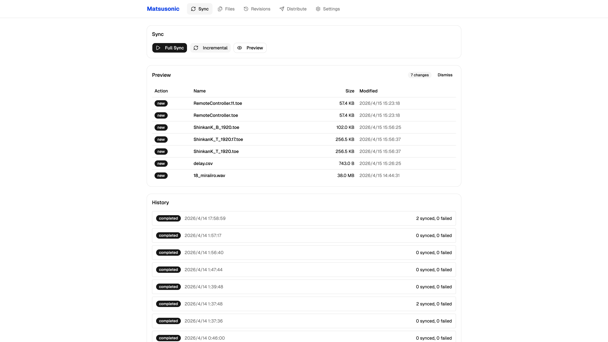

# gdrive-sync

[](https://go.dev/)
[](https://react.dev/)
[](LICENSE)

Google Drive からローカルへの一方向同期ツール。映像・バイナリなどの大容量ファイルに最適化。
Go バックエンド + React フロントエンドをシングルバイナリで配布。

<p align="center">
  
</p>

## 機能一覧

- **Full / Incremental Sync** — 再帰スキャンまたは Changes API による差分同期
- **並列ダウンロード** — ワーカープール制御（デフォルト 3 並列）
- **リアルタイム進捗** — WebSocket でブラウザ UI にライブ表示
- **Google Docs エクスポート** — PDF, XLSX, PPTX 等への自動変換（フォーマット設定可）
- **リビジョン管理** — 過去リビジョンの一覧・個別ダウンロード（命名パターン設定可）
- **配布 (Distribution)** — 同期済みファイルをローカルパスや SMB 共有へコピー（バッチ配布対応）
- **Ignore パターン** — glob ベースのファイル除外（`*.tmp`, `~*` 等）
- **ファイル検索** — 同期済みメタデータに対する全文検索
- **シングルバイナリ** — フロントエンドを `go:embed` で埋め込み、実行時の外部依存なし

## 対応 OS

| OS | ステータス | 備考 |
|----|-----------|------|
| **Windows** | メインターゲット | `make build-windows` で `.exe` を生成 |
| **macOS** | 対応 | 開発環境として使用 |
| **Linux** | 対応 | `make build-linux` でクロスコンパイル |

## クイックスタート

### 前提条件

- Go 1.22+（CGO 有効、SQLite に必要）
- Node.js 20+
- [Drive API](https://console.cloud.google.com/apis/library/drive.googleapis.com) を有効化した Google Cloud プロジェクト

[Nix](https://nixos.org/download/) を使う場合:

```bash
nix develop  # Go, Node.js, GCC を提供
```

### インストール

```bash
git clone https://github.com/P4sTela/matsu-sonic.git
cd matsu-sonic
make build
```

### 実行

```bash
./gdrive-sync                              # デフォルト: http://localhost:8765
./gdrive-sync -port 9000                   # ポート指定
./gdrive-sync -config /path/to/config.json # 設定ファイル指定
```

ブラウザで Settings ページを開き、Google Drive の認証情報と同期先を設定してください。

## セットアップ

### 1. Google Cloud クレデンシャルの準備

1. [Google Cloud Console](https://console.cloud.google.com/) でプロジェクトを作成（または既存を使用）
2. [Drive API を有効化](https://console.cloud.google.com/apis/library/drive.googleapis.com)
3. OAuth クレデンシャルを作成:
   - [認証情報ページ](https://console.cloud.google.com/apis/credentials) > 「認証情報を作成」 > 「OAuth クライアント ID」
   - アプリの種類: **デスクトップ アプリ**
   - 作成後、JSON をダウンロードしてプロジェクトディレクトリに配置

### 2. アプリケーション設定

1. サーバーを起動し、Web UI を開く
2. **Settings** ページで以下を設定:
   - **Credentials Path** — ダウンロードした OAuth JSON のパス（UI のブラウザボタンで選択可）
   - **Sync Folder ID** — 同期対象の Google Drive フォルダ ID（認証後は UI で選択可）
   - **Local Sync Directory** — ローカル同期先ディレクトリ（UI で作成・選択可）
3. **Save** → **Test Auth**（初回のみブラウザで OAuth 承認、以降は `token.json` で自動更新）

### 認証方式

| 方式 | 設定 | 用途 |
|------|------|------|
| **OAuth**（推奨） | `auth_method: "oauth"` | 自分の Drive 全体にアクセス可。共有フォルダ含む。初回のみブラウザ認証、以降自動 |
| **Service Account** | `auth_method: "service_account"` | ヘッドレス環境向け。対象フォルダを SA メールアドレスに共有する必要あり |

## 設定項目

設定ファイルは `.gdrive-sync/config.json`（初回起動時に作成）。Web UI からも編集可能。

| 項目 | 型 | デフォルト | 説明 |
|------|----|-----------|------|
| `auth_method` | `string` | `"oauth"` | `"oauth"` または `"service_account"` |
| `credentials_path` | `string` | — | OAuth / SA の JSON パス |
| `token_path` | `string` | `"token.json"` | OAuth トークンの保存先 |
| `sync_folder_id` | `string` | — | 同期対象の Google Drive フォルダ ID |
| `local_sync_dir` | `string` | — | ローカル同期先ディレクトリ |
| `export_formats` | `map` | Docs→PDF, Sheets→XLSX, Slides→PPTX | Google Docs のエクスポート形式 |
| `chunk_size_mb` | `int` | `10` | ダウンロードチャンクサイズ (MB) |
| `max_workers` | `int` | `3` | 並列ダウンロード数 |
| `revision_naming` | `string` | `"{stem}.rev{rev_id}{suffix}"` | リビジョンファイルの命名パターン |
| `ignore_patterns` | `[]string` | `[]` | 同期除外の glob パターン |
| `distribution_targets` | `[]object` | `[]` | 配布先の設定（下記参照） |

### 配布先の設定例

```json
{
  "distribution_targets": [
    { "name": "archive", "type": "local", "path": "/mnt/archive" },
    {
      "name": "office-pc",
      "type": "smb",
      "server": "192.168.1.10",
      "share": "shared-folder",
      "username": "user",
      "password": "pass",
      "domain": "WORKGROUP"
    }
  ]
}
```

## 開発

### 開発モード

```bash
task dev   # フロントエンド (HMR) + Go サーバー (air によるホットリロード) を同時起動
```

http://localhost:3000 を開く。Go ファイルを編集すると自動でリビルド・再起動されます。

### ビルド

```bash
task build          # フロントエンド + Go バイナリ (./gdrive-sync)
task build-linux    # Linux amd64 向けクロスコンパイル
task build-windows  # Windows amd64 向けクロスコンパイル (.exe)
task test           # Go テスト実行
task clean          # ビルド成果物の削除
```

### 手動ビルド

```bash
cd frontend && npm ci && npx vite build && cd ..
CGO_ENABLED=1 go build -o gdrive-sync -ldflags="-s -w" .
```

### リリース

`v*` タグを push すると GitHub Actions が Windows / macOS / Linux 向けバイナリをビルドし、GitHub Release を自動作成します。

```bash
git tag v1.0.0
git push origin v1.0.0
```

バージョンはビルド時に `ldflags` で埋め込まれます。`--version` フラグで確認可能:

```bash
./gdrive-sync --version
# gdrive-sync v1.0.0
```

## アーキテクチャ

```
gdrive-sync
├── main.go                 # エントリポイント (CLI)
├── embed.go                # go:embed frontend/dist
├── internal/
│   ├── config/             # 設定構造体、JSON ローダー (デフォルト値付き)
│   ├── store/              # SQLite (WAL): files, runs, revisions, distribution_jobs
│   ├── drive/              # Google Drive API: 認証, 一覧, ダウンロード, リビジョン
│   ├── sync/               # 同期エンジン, 差分判定 (MD5), 進捗追跡
│   ├── server/             # Chi v5 ルーター, ミドルウェア, WebSocket Hub
│   ├── handler/            # REST API エンドポイント
│   └── distribution/       # コピー先 Target (ローカル, SMB)
└── frontend/
    └── src/
        ├── api/            # 型定義, fetch ラッパー, WebSocket クライアント
        ├── hooks/          # useSync, useWebSocket, useConfig
        ├── pages/          # Sync, Files, Revisions, Distribution, Settings
        └── components/     # ProgressBar, FileTree, DirBrowser, shadcn/ui
```

### 技術スタック

**バックエンド**

| 技術 | 用途 |
|------|------|
| [Go](https://go.dev/) | サーバー, 同期エンジン, CLI |
| [Chi v5](https://github.com/go-chi/chi) | HTTP ルーティング & ミドルウェア |
| [gorilla/websocket](https://github.com/gorilla/websocket) | リアルタイム進捗通知 |
| [SQLite](https://github.com/mattn/go-sqlite3) (WAL) | メタデータ & 同期履歴 |
| [google-api-go-client](https://github.com/googleapis/google-api-go-client) | Drive API |
| [errgroup](https://pkg.go.dev/golang.org/x/sync/errgroup) | 並列ダウンロード制御 |
| [go-smb2](https://github.com/hirochachacha/go-smb2) | SMB/CIFS ファイル配布 |
| [air](https://github.com/air-verse/air) | Go ホットリロード (開発時) |

**フロントエンド**

| 技術 | 用途 |
|------|------|
| [React 19](https://react.dev/) + TypeScript | UI |
| [Vite](https://vite.dev/) | ビルド & HMR |
| [Tailwind CSS v4](https://tailwindcss.com/) | スタイリング |
| [shadcn/ui](https://ui.shadcn.com/) | UI コンポーネント |
| [React Router v7](https://reactrouter.com/) | ルーティング |
| [lucide-react](https://lucide.dev/) | アイコン |

### API 一覧

| メソッド | エンドポイント | 説明 |
|----------|---------------|------|
| `GET` | `/api/config` | 現在の設定を取得 |
| `POST` | `/api/config` | 設定を更新 |
| `POST` | `/api/auth/test` | Drive API 認証テスト |
| `POST` | `/api/sync/full` | フル同期を開始 |
| `POST` | `/api/sync/incremental` | 差分同期を開始 |
| `POST` | `/api/sync/cancel` | 実行中の同期をキャンセル |
| `GET` | `/api/sync/status` | 同期進捗スナップショット |
| `GET` | `/api/sync/diff` | ドライラン: 変更プレビュー |
| `GET` | `/api/sync/history` | 同期履歴の取得 |
| `POST` | `/api/sync/reset` | 同期レコードを全削除 |
| `GET` | `/api/files` | 同期済みファイル一覧（`?search=` 対応） |
| `GET` | `/api/files/{id}/revisions` | ファイルのリビジョン一覧 |
| `POST` | `/api/files/{id}/revisions/{rev}/download` | 特定リビジョンをダウンロード |
| `GET` | `/api/distribution/targets` | 配布先一覧 |
| `POST` | `/api/distribute` | ファイルを配布先にコピー |
| `GET` | `/ws` | WebSocket（リアルタイム進捗） |

## ロードマップ

- [x] **SMB/CIFS 配布先** — ネットワーク共有へのコピー対応（NTLM 認証、バッチ配布）
- [ ] **配布先ディレクトリのカスタマイズ** — 配布実行時にジョブごとの配布先を指定
- [ ] **スケジュール同期** — 定期的な自動同期
- [ ] **選択同期** — フォルダ/ファイル単位で同期対象を選択
- [ ] **同期コンフリクト検出** — ローカルファイルの変更を警告
- [ ] **通知** — 同期完了/エラー時のデスクトップ・Webhook 通知
- [ ] **マルチフォルダ同期** — 複数の Drive フォルダからの同期
- [ ] **Docker イメージ** — コンテナでの簡単デプロイ
- [ ] **共有ドライブ対応** — Google Workspace 共有ドライブのファーストクラスサポート
- [ ] **帯域制限** — ダウンロード速度の制限設定
- [ ] **ファイル整合性検証** — ダウンロード後のチェックサム検証

## ライセンス

[MIT](LICENSE)
